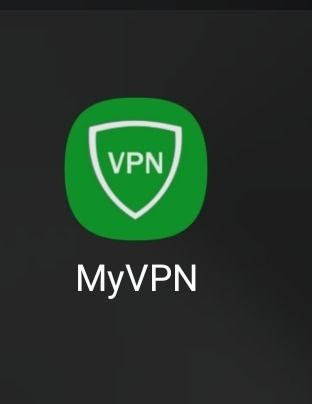
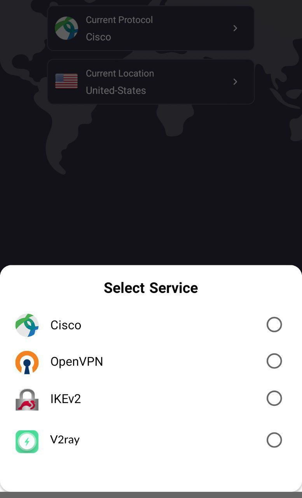

<html lang="fa">
<head>
    <meta charset="UTF-8">
    <meta name="viewport" content="width=device-width, initial-scale=1.0">
    <title>وب‌سایت موبایل مصطفی</title>
    
</head>
<body>

    موبایل مصطفی 
    کلیه خدمات تلفن همراه - 44 119 48 0935

<!-- سایر محتوای صفحه شما اینجا قرار می‌گیرد -->

</body>
</html>

---

🟢 [**Android دانلود برنامه هوشمند کلیک کنید**](https://my.uupload.ir/dl/BvmraYQp) - [link2](https://www.mediafire.com/file/1xengglmo53tf4d/io.github.segas.myvpn-v2.67-51-release.apk/file)

---

 [Android  ورژن قدیمی](https://drive.google.com/uc?export=download&id=1Gj96dzEhWtm8P4fFnEli-F8deimAxTQS) 
 
---

🟢 [**Windows**](https://drive.google.com/file/d/19r3qO1on-Qm8LmMH2r3UyCCNu9g4L8kf/view?usp=sharing) - [link2](https://drive.usercontent.google.com/download?id=19r3qO1on-Qm8LmMH2r3UyCCNu9g4L8kf&export=download&authuser=0)

_____________________________________________________

برای اطلاع از آخرین تغییرات در کانال تلگرام ما عضو شوید

✅ [**Telegram channel**](https://t.me/+TOnGIN-7yqE8tPxm)

---

 
        

 برنامه رو از لینک بالا با فیلتر شکن خاموش دانلود و نصب و اجرا میکنیم.

با وارد کردن نام کاربری و رمز عبور خریداری شده وارد برنامه میشویم و با انتخاب یکی از سرور های موجود متصل میشویم.
        

<small>

<small>

---
[iKev اتصال با](ikev.md)

[L2tp اتصال با](L2tp.md)

[cisco اتصال با ](openconnect.md) 

[openvpn اتصال با ](openvpn.md) 

________________________________________

Contact Us → [Telegram](http://t.me/fastfixgsm) & [gfix4600@gmail.com](mailto:gfix4600@gmail.com)   
